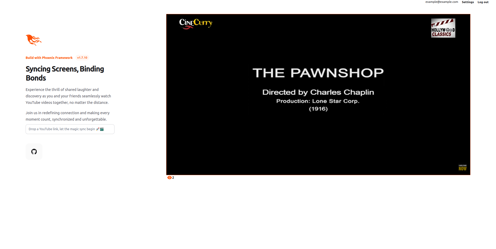

# <p align="center">Syncit</p>

[](https://stand-with-ukraine.pp.ua)
[](https://github.com/yakimenko73/syncit/actions/workflows/docker-image.yml)

## What is it?

**Syncit** is a simple collaborative video-watching platform that enables users to synchronize their YouTube video
playback in soft real-time utilizing Elixir Phoenix Channels to establish WebSocket connections between users for
bidirectional communication.



### Features

* Auth:

  Platform integrates the `Phoenix.Auth` module to provide a robust and secure authentication system for users accessing.

* Pause and Resume:

  The system supports the ability to pause and resume video playback seamlessly across all connected clients. This is
  achieved by broadcasting pause and play events.

* Seek Position Synchronization:

  When a user seeks to a specific position in the video, the `Phoenix.Channels` handle the synchronization of this
  action across all connected clients.

* Dynamic Viewers Count Display:

  Through `Phoenix.LiveView`, the platform provides a dynamic display of the current number of viewers, ensuring that
  the count is updated in soft real-time as users join or leave site.

* LiveView Hooks for Integration:

  Custom `phx-hook` implemented to manage replacing videos seamlessly.

* Player Agent for State Management:

  Platform leverages the `Agent` module to manage the state of the video player across the entire app.

### Built With

* [Phoenix](https://hexdocs.pm/phoenix/Phoenix.html)
* [Phoenix LiveView](https://hexdocs.pm/phoenix_live_view/Phoenix.LiveView.html)
* [Ecto](https://hexdocs.pm/ecto/Ecto.html)
* [Cowboy](https://hex.pm/packages/cowboy)
* [PostgreSQL](https://www.postgresql.org/)

## Getting Started

### Installation

Clone the repo:

  ```shell
  git clone https://github.com/yakimenko73/syncit.git
  ```

#### To start Phoenix server manually:

1. Install and setup dependencies:

  ```shell
  mix setup
  ```

2. Start Phoenix endpoint:

  ```shell
  mix phx.server
  ```

or inside IEx:

  ```shell
  iex -S mix phx.server
  ````

#### Using Docker:

1. Build image with `MIX_ENV` argument:

  ```shell
  docker build --tag syncit --build-arg MIX_ENV=dev .
  ```

2. Create `.env` file and fill it according to the `.env.sample`

  ```shell
  cat .env.sample >> .env
  ```

3. Run container:

  ```shell
  docker run --net host --env-file .env syncit
  ```

Now you can visit [`localhost:4000`](http://localhost:4000) from your browser.